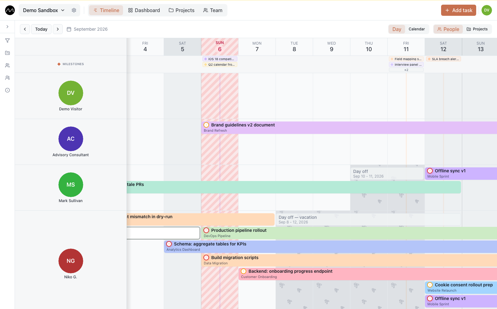

<div align="center">

<picture>
  <source media="(prefers-color-scheme: dark)" srcset=".github/assets/logo-dark-mode.png">
  
</picture>

# Motio

**Team task planning on a timeline.**

Plan work across people and projects on a drag-and-drop timeline,
keep the whole team's workload visible — self-hosted, with SSO out of the box.

[](./CHANGELOG.en.md)
[](https://react.dev/)
[](https://www.typescriptlang.org/)
[](https://vitejs.dev/)
[](https://supabase.com/)
[](https://www.keycloak.org/)

[Features](#-features) · [Quick start](#-quick-start) · [Architecture](#-architecture) · [Documentation](#-documentation)



</div>

## ✨ Features

- 📅 **Timeline and calendar** — an interactive planner with day/calendar views and a task detail panel.
- 👥 **Workspaces and roles** — `viewer` / `editor` / `admin`, per-workspace members and invitations.
- 🔐 **SSO out of the box** — sign-in through Keycloak + oauth2-proxy; user lifecycle lives in the Keycloak Admin Console.
- 🖼 **Task media** — paste, drag or upload images straight into task descriptions, with per-user and per-workspace quotas.
- 💾 **Backups built in** — scheduled backups with upload/download and one-click restore from the admin console.
- 🗄 **Super-admin console** — user overview, workspace management, backup/restore.
- 🌍 **Two languages** — English and Russian UI (Lingui).

## 🚀 Quick start

Requirements: **Node.js 20+**, **Docker Desktop**.

```bash
make up      # full local stack: Postgres, Keycloak, Supabase services, web
make down    # stop
make logs    # follow logs
```

| Service | URL |
|---|---|
| App | http://localhost:5173 |
| Keycloak | http://localhost:8081 |
| Supabase Gateway health | http://localhost:8080/health |
| Postgres | `localhost:54322` |

`make up` generates `.env` with dev secrets, applies Liquibase migrations and
synchronizes Keycloak ↔ Supabase — no manual setup needed.

Production, remote deploy and releases: see [docs/operations.md](docs/operations.md).

## 🏗 Architecture

| Layer | Technologies |
|---|---|
| **Frontend** | Vite · React 18 · TypeScript · Zustand · TanStack Query · Tailwind · Radix UI |
| **Backend** | Supabase, self-hosted (Postgres · GoTrue · PostgREST · Edge Functions) |
| **Auth / SSO** | Keycloak · oauth2-proxy |
| **Infrastructure** | Docker Compose · Nginx · Liquibase · standalone backup-service |

```
Browser → oauth2-proxy → Keycloak (OIDC) → Supabase (identity link)
```

<details>
<summary>Repository structure</summary>

```
.
├── src/           — frontend (Vite + React + TS)
├── docs/          — documentation (operations, configuration, architecture, troubleshooting)
├── infra/
│   ├── docker-compose.yml / docker-compose.prod.yml
│   ├── supabase/  — SQL migrations, Liquibase changelog, Edge Functions, gateway nginx
│   ├── keycloak/  — realm baselines (dev + production)
│   ├── backup-service/
│   └── scripts/   — dev/prod compose, deploy, Keycloak realm sync
├── tests/         — DB integration tests (RLS, RPC, cron)
├── notes/         — local working notes (gitignored, absent on a fresh clone)
└── Makefile
```

</details>

Details: [docs/architecture.md](docs/architecture.md).

## 📚 Documentation

| | |
|---|---|
| [docs/operations.md](docs/operations.md) | local dev, production, deploy, releases, migrations, backup/restore |
| [docs/configuration.md](docs/configuration.md) | environment variables |
| [docs/architecture.md](docs/architecture.md) | stack, auth flow, Edge Functions, admin console |
| [docs/troubleshooting.md](docs/troubleshooting.md) | common errors and fixes |
| [CHANGELOG.en.md](./CHANGELOG.en.md) · [CHANGELOG.md](./CHANGELOG.md) | change history (en / ru) |
| [MANIFESTO.md](./MANIFESTO.md) | product principles |
| [AGENTS.md](./AGENTS.md) | working instructions for AI assistants |

## 🤝 Contributing

1. Fork and create a feature branch: `git checkout -b feature/my-feature`.
2. `npm install`, then bring up the stack: `make up`.
3. Add tests and keep it clean: `npm run test`, `npm run lint`, `npm run typecheck`
   (plus `npm run test:integration` when touching RPC/RLS/cron).
4. New UI strings go through Lingui: `npm run lingui:extract && npm run lingui:compile`.
5. Open a PR with a clear description and a `CHANGELOG.md` entry (`Unreleased` section).

## 📄 License

Private / proprietary. All rights reserved.
