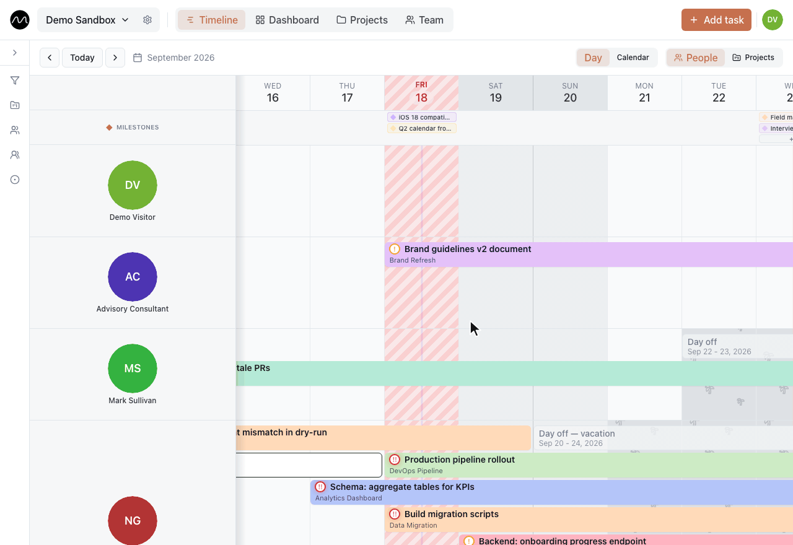

<div align="center">

<picture>
  <source media="(prefers-color-scheme: dark)" srcset=".github/assets/logo-dark-mode.png">
  
</picture>

# Motio

**See who's doing what this week — across every project.**

One shared timeline for your whole team: people, projects and workload on a single screen.
Free and open source: use the hosted app, or run it on your own servers. The live demo needs no sign-up.

**[▶ Try the live demo](https://motio.nikog.net/demo?utm_source=github&utm_medium=readme)** &nbsp;·&nbsp; **[Open Motio](https://motio.nikog.net/?utm_source=github&utm_medium=readme)** &nbsp;·&nbsp; **[Self-host it](#-self-host)** &nbsp;·&nbsp; [What's new](./CHANGELOG.en.md)

[](./CHANGELOG.en.md)
[](https://github.com/eleron96/motio/actions/workflows/ci.yml)
[](./LICENSE)

[](https://motio.nikog.net/demo?utm_source=github&utm_medium=readme&utm_content=gif)

<sub>Recorded in the live demo. Click it to try the same yourself — no sign-up.</sub>

[Why Motio](#why-motio) · [Features](#-features) · [Self-host](#-self-host) · [Architecture](#-architecture) · [Documentation](#-documentation)

</div>

## Why Motio

Most tools answer "what's in project X?". Motio answers the question a team lead actually asks on Monday: **who is busy, who is free, and where does the next task go?**

- 👥 **People first, not tasks first.** Every row is a person, every bar is their work — across all projects at once. Elsewhere that is one view among many; in Motio it is the product.
- 🔥 **Overload shows up before the deadline does.** Workload sits on the same timeline and in a department heatmap, so you see who is full without assembling a report from boards, filters and spreadsheets.
- ⚡ **Any task in 10 seconds.** Click, type, drag. No custom fields, no automations, no kanban mode — that is a position, not a missing feature. The [manifesto](./MANIFESTO.md) (in Russian) explains why.
- 🔓 **Yours to run.** Open source under AGPL-3.0. Use the free hosted app, or keep the data inside your own perimeter: Docker Compose, Postgres, SSO via Keycloak, built-in backups and a full data export.

Built for teams of 5–50 people running several projects at once. It grew out of years of managing BIM and engineering project teams, and one recurring Monday question: who's free this week?

**New to Motio?** Three five-minute guides: [your first week](docs/guides/first-week.md) · [several projects, one team](docs/guides/multiple-projects.md) · [spotting overload early](docs/guides/spotting-overload.md).

## ✨ Features

- 📅 **Timeline** — drag-and-drop planner grouped by people or by project, with day / week / calendar views; milestones and time off sit on the same grid. Drag a task past the edge of the screen and the timeline scrolls along.
- ✅ **Tasks with depth** — subtasks, repeating series, priorities, tags, rich descriptions with pasted images, comments with @mentions and screenshots.
- 👥 **Team** — members and groups, each person's current and past tasks at a glance.
- 📁 **Projects and customers** — project cards with their team and customer contacts, a workspace-wide contact list; people you have entered before are suggested as you type.
- 📊 **Dashboard** — configurable widgets and a department workload heatmap; a daily brief once a day and release notes right in the app.
- 🔔 **Notifications** — in-app inbox plus browser push; installable as a PWA, push works on iPhone too.
- 📱 **Works on phones** — a dedicated mobile layer for the timeline, tasks, team and projects.
- 🏢 **Workspaces and roles** — `viewer` / `editor` / `admin`, invitations, owner transfer, leaving a workspace.
- 🔐 **SSO out of the box** — sign-in through Keycloak; sign-up is self-service (the app opens the Keycloak registration form), while invitations and account deletion happen in the app itself, Keycloak is the identity store.
- 💾 **Backups built in** — daily backups of the database, media and Keycloak with retention, upload/download and one-click restore from the admin console.
- 🗄 **Super-admin console** — user overview, workspace management, backup/restore, announcements to every user.
- 🧪 **Demo sandbox** — [`/demo`](https://motio.nikog.net/demo?utm_source=github&utm_medium=readme) runs entirely in the browser on sample data, no sign-in needed.
- 🌍 **Two languages** — English and Russian UI (Lingui).

## 🚀 Self-host

Most teams just [sign up](https://motio.nikog.net/?utm_source=github&utm_medium=readme) and start working. If your data has to stay inside your own perimeter, Motio runs on your infrastructure — the same stack that serves motio.nikog.net.

### Try it on your machine

Requirements: **Node.js 20+**, **Docker Desktop**.

```bash
make up      # full local stack: Postgres, Keycloak, Supabase services, web
make down    # stop
make logs    # follow logs
```

| Service | URL |
|---|---|
| App | http://localhost:5173 |
| Keycloak | http://localhost:8081 |
| Supabase Gateway health | http://localhost:8080/health |
| Postgres | `localhost:54322` |

`make up` generates `.env` with dev secrets, applies Liquibase migrations and
creates the reserve super-admin account — no manual setup needed.

### Run it for your team

The production stack is `infra/docker-compose.prod.yml` behind Caddy (TLS), with Keycloak
for sign-in. Fill in `.env` ([docs/configuration.md](docs/configuration.md)) and start it
with `make up-prod`; remote deploy, releases, backups and disaster recovery are described
in [docs/operations.md](docs/operations.md).

An honest caveat: there is no one-command installer for other domains yet. The Caddyfile
and the production Keycloak realm still carry the `motio.nikog.net` domain, so expect to
replace it with your own. Self-hosting is community-supported — questions are welcome in
[Discussions → Q&A](https://github.com/eleron96/motio/discussions/categories/q-a).

## 🏗 Architecture

[](https://react.dev/)
[](https://www.typescriptlang.org/)
[](https://vitejs.dev/)
[](https://supabase.com/)
[](https://www.keycloak.org/)

| Layer | Technologies |
|---|---|
| **Frontend** | Vite · React 18 · TypeScript · Zustand · TanStack Query · Tailwind · Radix UI |
| **Backend** | Supabase, self-hosted (Postgres · GoTrue · PostgREST · Edge Functions) |
| **Auth / SSO** | Keycloak (OIDC) · oauth2-proxy (fallback for non-public paths) |
| **Infrastructure** | Docker Compose · Caddy (TLS edge) · Nginx (Supabase gateway) · Liquibase · standalone backup-service |

```
Browser → Caddy (TLS) → SPA (web) → Supabase GoTrue /auth/v1 → Keycloak (OIDC)
```

In production Caddy is the edge (TLS, domains, security headers) and the SPA starts
sign-in itself; oauth2-proxy stays as a fallback catch-all for non-public paths.

<details>
<summary>Repository structure</summary>

```
.
├── src/           — frontend (Vite + React + TS)
├── docs/          — documentation (operations, configuration, architecture, troubleshooting)
├── infra/
│   ├── docker-compose.yml / docker-compose.prod.yml
│   ├── supabase/  — SQL migrations, Liquibase changelog, Edge Functions, gateway nginx
│   ├── keycloak/  — realm baselines (dev + production)
│   ├── backup-service/
│   └── scripts/   — dev/prod compose, deploy, Keycloak realm sync
├── tests/         — DB integration tests (RLS, RPC, cron)
├── notes/         — local working notes (gitignored, absent on a fresh clone)
└── Makefile
```

</details>

Details: [docs/architecture.md](docs/architecture.md).

## 📚 Documentation

| | |
|---|---|
| [docs/guides/](docs/guides/) | how to plan with Motio: first week, several projects, spotting overload |
| [docs/operations.md](docs/operations.md) | local dev, production, deploy, releases, migrations, backup/restore |
| [docs/configuration.md](docs/configuration.md) | environment variables |
| [docs/architecture.md](docs/architecture.md) | stack, auth flow, Edge Functions, admin console |
| [docs/troubleshooting.md](docs/troubleshooting.md) | common errors and fixes |
| [CHANGELOG.en.md](./CHANGELOG.en.md) · [CHANGELOG.md](./CHANGELOG.md) | change history (en / ru) |
| [MANIFESTO.md](./MANIFESTO.md) | product principles |
| [CONTRIBUTING.md](./CONTRIBUTING.md) | how to report a bug, propose an idea or send a pull request |
| [SECURITY.md](./SECURITY.md) | how to report a security problem privately |
| [CODE_OF_CONDUCT.md](./CODE_OF_CONDUCT.md) | how we treat each other in issues, discussions and pull requests |
| [AGENTS.md](./AGENTS.md) | working instructions for AI assistants |

## 🤝 Contributing

Found a bug or hit a wall? [Open an issue](https://github.com/eleron96/motio/issues/new/choose).
Have a question, or want to show how your team plans its week? Head to
[Discussions](https://github.com/eleron96/motio/discussions). Setup, checks and the
note on licensing for pull requests are in [CONTRIBUTING.md](./CONTRIBUTING.md), and
everyone taking part follows the [Code of Conduct](./CODE_OF_CONDUCT.md).

Security problem? Please report it privately — see [SECURITY.md](./SECURITY.md).

## 📄 License

Motio is free software under the [GNU Affero General Public License v3.0](./LICENSE)
(`AGPL-3.0-only`). You can use it, run it for your team on your own servers, study it,
change it and share it. If you let other people use a modified version over a network,
you must offer them the source of that version under the same licence.

Copyright © 2026 Niko G.

The name "Motio" and the Motio logo are not covered by the licence: a fork, or a modified
version offered to others, needs a name and a logo of its own.

Need different terms — for example, to build Motio into a closed product? Write to
[inbox@nikog.net](mailto:inbox@nikog.net).
