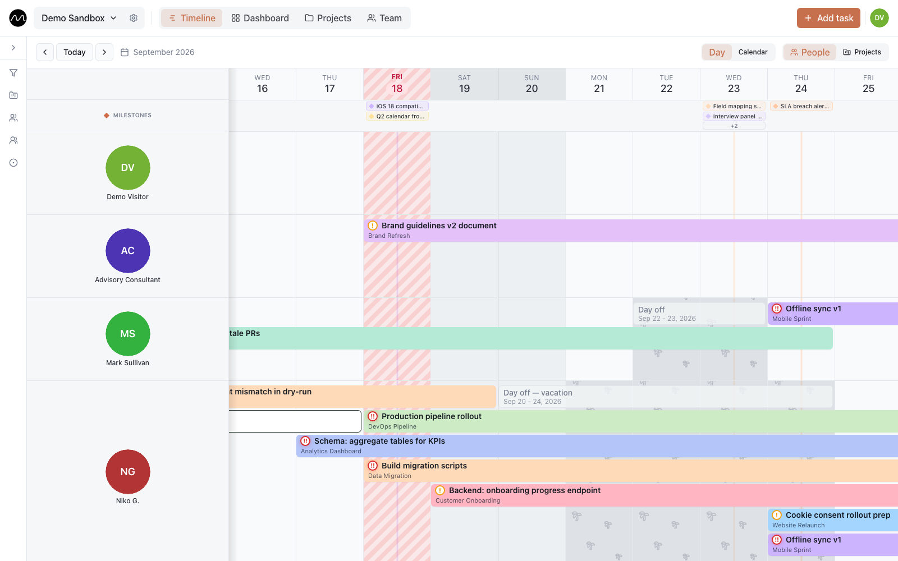

# Your first week in Motio

*Five minutes to set up, one real week to find out whether a shared team timeline works for you.*

Motio is built around the question a team lead asks every Monday: **who is doing what
this week, and where does the next task go?** This guide gets you to that answer with
your team's actual work, not a tutorial project.

Follow along in the **[live demo](https://motio.nikog.net/demo?utm_source=github&utm_medium=guide&utm_campaign=first_week)**,
which needs no sign-up and resets on its own, or in your own workspace at
[motio.nikog.net](https://motio.nikog.net/?utm_source=github&utm_medium=guide&utm_campaign=first_week).

## Monday: put this week on the timeline

A new workspace starts with a few example tasks, so the screen isn't empty. Look around
with them, then press **Remove examples** in the banner to clear them in one go.

Now add the work that is really on the table this week:

1. **Double-click a day in a person's row.** The task form opens with that person and
   that date already filled in. **Add task** in the top right does the same, just
   without the shortcut.
2. Type a title and pick the project. Stretch the dates if the task runs longer than a day.
3. Save, and move on to the next one.

Aim for ten seconds per task. A rough plan of ten real tasks is worth more than a
perfect plan of three. If adding a task takes you longer than that, something in Motio
is in your way — [tell us where](https://github.com/eleron96/motio/issues/new/choose).

## Tuesday: invite the people you plan for

Planning alone is a to-do list; the timeline pays off when the whole team sees the same
picture. Open the workspace settings — the gear next to the workspace name — then
**Members and access**, and invite your colleagues. Each of them gets a role:

- **viewer** sees everything and changes nothing — for people who only need to know the plan;
- **editor** creates and moves tasks;
- **admin** also manages members and the workspace settings.

## Wednesday: change the plan by dragging

Plans change daily, and in Motio most changes are a drag rather than a form:

- drag a bar sideways to move its dates;
- drag it into another row to hand the task to someone else;
- drag its edge to make it shorter or longer.

Drag past the edge of the screen and the timeline scrolls along with you. Everyone in
the workspace sees the change straight away, without reloading the page.

## Thursday: mark who is away

A plan that ignores vacations is a wish list. Open **Add task**, switch to
**Mark time off** and pick the days. Everyone can mark their own time off; admins can
mark it for anyone. It shows up on the timeline as a grey **Day off** bar, so nobody
plans work into those days by accident.

## Friday: add the deadlines that matter

Double-click a day in the **Milestones** row above the timeline, or right-click a date
in the header and choose **Create milestone**, then link it to its project. Milestones
sit above every row, so each person sees what the whole team is working towards — not
only their own tasks.

Then switch the grouping in the toolbar from **People** to **Projects**: the same tasks,
one row per project. It is the quickest way to check that every project has someone on
it next week.

## What to skip in week one

Statuses, task types, tags, repeating tasks, groups, dashboards — they are all there
when you need them, and none of them is needed to answer "who is doing what this week".
Plan first. Configure later, and only what you actually miss.

## Next

- [Planning several projects with one team](./multiple-projects.md)
- [Spotting overload before it becomes a problem](./spotting-overload.md)
