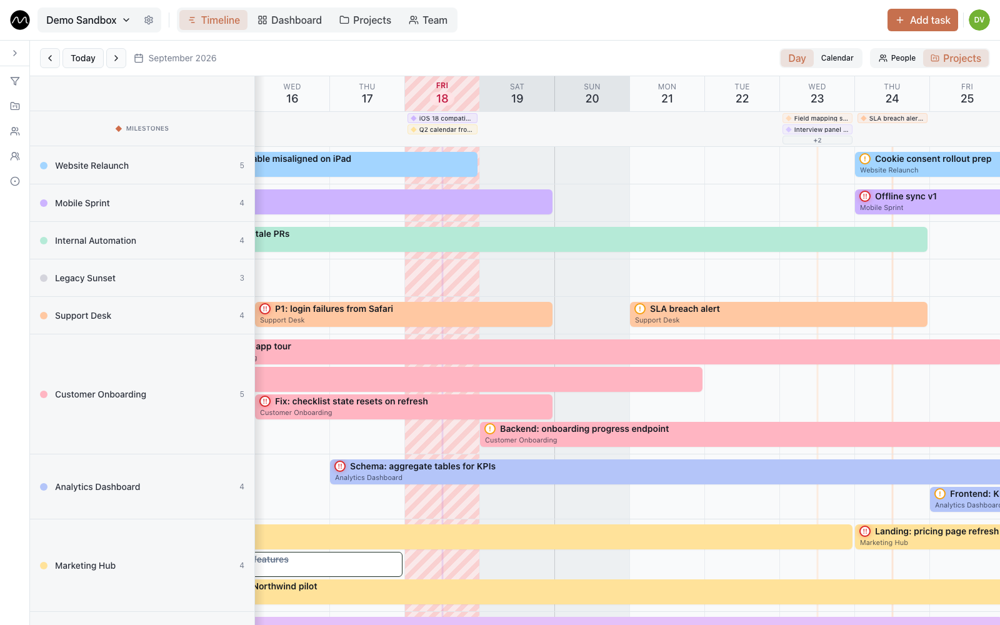

# Planning several projects with one team

*For teams where the same people work on several client or internal projects at once.*

The usual way to plan several projects is one board, or one spreadsheet tab, per
project. Each of them looks fine on its own. The trouble starts when the same four
people appear in all of them, and nobody notices that one of them is booked three times
on Wednesday.

Motio turns that around. The timeline's main axis is **people**; projects are the colour
of their work. Everything below can be tried in the
**[live demo](https://motio.nikog.net/demo?utm_source=github&utm_medium=guide&utm_campaign=multi_project)**.

## Set projects up once

Open **Projects** in the top bar and create a project for each stream of work you plan
separately: a client job, an internal initiative, a support rota. Give each a colour you
will recognise at a glance — every task bar on the timeline takes the colour of its
project.

If you work for clients, add the client as well. One client can have several projects,
and a project's card keeps its tasks, its team, the client's contacts and the notes in
one place.

## Plan in People, review in Projects

The toolbar above the timeline switches between two groupings of the same tasks:

- **People** — one row per person, bars coloured by project. This is where you plan: you
  see at a glance that someone already has two projects running this week.
- **Projects** — one row per project. This is where you review: what is happening in
  each project, and who is on it.

A rhythm that works: plan in **People**, then flip to **Projects** before a client call
to check that nothing is missing.

## Where does the next task go?

This is the everyday question, and the reason Motio exists.

1. Stay in the **People** view on the current week.
2. Find a row with a gap on the days you need — someone without bars there.
3. Double-click the gap. The form opens with that person and that date filled in; pick
   the project, type the title, save.

If nobody has a gap, that is an answer too: something has to move, and it is better to
find out on Monday than on Thursday. Drag a less urgent task to later, or hand it to
someone else by dragging it into their row.

## Narrow the view to what you're discussing

The filter panel — the funnel icon on the left edge — narrows the timeline to chosen
projects, people, groups, statuses or tags. Use it to walk a client through their
project only, or to look at one department.

If the team is split into disciplines or departments, create them as groups on the
**Team** page with **New group** — say, Design and Development — and filter the timeline
by them.

## Keep every project's deadlines in sight

A milestone belongs to one project, but it is shown above every row. Each person sees
all the deliveries coming up, not only their own project's — and that is usually where
the collisions hide. The **Projects** page also lists the milestones of all projects in
one place.

## A weekly routine in fifteen minutes

- **Monday** — People view, current week: close the gaps, pull the overlaps apart.
- **During the week** — drag what slipped; hand work over by dragging it into another row.
- **Friday** — Projects view, next week: does every project have someone on it?

Motio deliberately has no task dependencies, no custom fields and no automations. When
the same few people carry several projects, the hard part isn't modelling the work —
it's seeing it. That is the one thing the timeline is for.

## Next

- [Spotting overload before it becomes a problem](./spotting-overload.md)
- [Your first week in Motio](./first-week.md)
