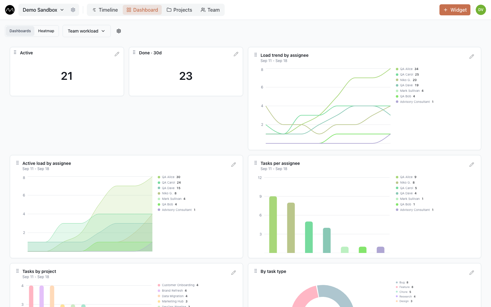
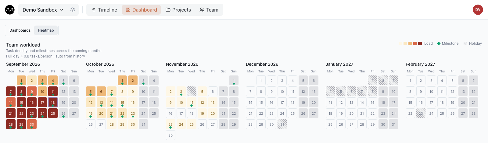

# Spotting overload before it becomes a problem

*How to see that someone — or the whole team — is about to be overloaded, while there is still time to do something about it.*

Overload rarely announces itself. It turns up as a missed deadline, an "I'll finish it
tonight" in the chat, or a retro where everyone says the sprint was "a bit much". By
then it is too late to rebalance.

Motio shows it earlier, at three distances: this week, the last few weeks and the months
ahead. Each of them can be tried in the
**[live demo](https://motio.nikog.net/demo/dashboard?utm_source=github&utm_medium=guide&utm_campaign=overload)**.

## This week: read the rows

In the **People** view each row is one person, and tasks that overlap stack up inside
that row. Scan the rows on Monday:

- **A row stacked three bars deep** — three things at once. Overloaded, or about to be.
- **An empty stretch** — free capacity, and the natural place for the next task.
- **A grey Day off bar** — that person is away; don't count on them.

Fix it on the spot: drag a bar into someone else's row, or stretch it over more days.

## The last few weeks: the dashboard

**Dashboard** shows what the timeline can't show at a glance — trends. Editors and
admins add widgets with **+ Widget**: counters and bar, line, area and pie charts, each
filtered by person, project or status.

A first dashboard worth building: active tasks per person as a bar chart, each person's
load over time as a line chart, and a counter of tasks done in the last 30 days. A line
that keeps climbing for one person is overload in slow motion.

## The months ahead: the workload heatmap

**Dashboard → Heatmap** lays the coming months out as calendars. Each day is coloured
from pale (quiet) to dark red (over capacity); green diamonds are milestones, hatched
days are public holidays.

How a day gets its colour, in plain words:

- **Work per available person.** The day's tasks are divided among the people who are
  actually there. With two of six on vacation, the same work lands on four, and the day
  turns hotter.
- **Measured against your team's normal.** A full day means full for *this* team. Motio
  works it out from your own recent history and shows it above the calendars — for
  example, "Full day ≈ 0.8 tasks/person". An admin can set it by hand instead.
- **Deliveries take people.** A milestone ties up a small crew in the days before it:
  barely visible four days out, at its peak the day before. Several deliveries on the
  same day hit a small team hard — which is exactly what you want to see coming.

Click a day to see its milestones and how many people are away, then
**Open on timeline** to jump straight to that date and move things around.

Two habits keep the picture honest:

- **Mark time off.** Nothing changes the heatmap more.
- **Leave out milestones that don't occupy anyone** — a contract date, a reminder — by
  unticking **Counts toward department workload** in the milestone.

### Turning the heatmap on

The heatmap is off by default and marked *experimental*. A workspace admin turns it on
in the workspace settings — the gear next to the workspace name — under **Display** →
**Workload heatmap**. The manual "full working day" lives in the same place. On a
self-hosted install the board also has to be switched on at build time with
`VITE_FEATURE_WORKLOAD_HEATMAP=true`.

If it reads wrong for your team, [tell us how](https://github.com/eleron96/motio/discussions/categories/ideas).
The model is young, and real teams are how it gets better.

## A five-minute Monday check

1. Open the **Heatmap** and look at the next two months: find the darkest days.
2. Click one, then **Open on timeline**.
3. Move one task, or hand it over — before anyone has to say "it's a bit much".

## Next

- [Your first week in Motio](./first-week.md)
- [Planning several projects with one team](./multiple-projects.md)
